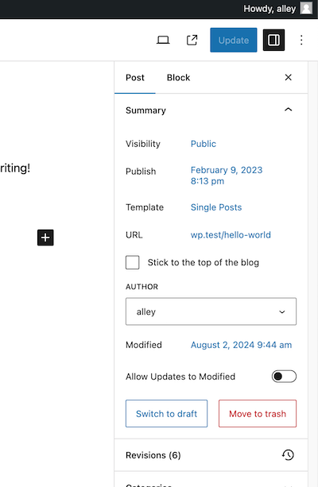

# Modified Date Control

Contributors: alleyinteractive

Tags: alleyinteractive, wp-modified-date-control

Stable tag: 1.0.0

Requires at least: 5.9

Tested up to: 6.1

Requires PHP: 8.1

License: GPL v2 or later

[![Testing Suite]](https://github.com/alleyinteractive/wp-modified-date-control/actions/workflows/all-pr-tests.yml/badge.svg)](https://github.com/alleyinteractive/wp-modified-date-control/actions/workflows/all-pr-tests.yml)

Control the modified date for a post with Gutenberg.

## Installation

You can install the package via Composer:

```bash
composer require alleyinteractive/wp-modified-date-control
```

## Usage

Activate the plugin in WordPress and you will see a new panel available under
the "Summary" section in Gutenberg:



The panel will allow you to set a modified date for a post or allow the modified
date to be set to the current date and time upon update. Out of the box, the
plugin will continue to allow updates to the modified date unless disabled on a
per-post basis.

### Filters

#### `wp_modified_date_control_prevent_updates`

Modify the default behavior of the plugin to allow/deny updates to the modified
date. By default, the plugin will prevent updates if the meta to allow updates
is set to `'false'`. This filter allows you to override that behavior.

```php
add_filter( 'wp_modified_date_control_prevent_updates', function( bool $prevent, int $post_id, ?\WP_REST_Request $request ) {
	// Always allow updates to the modified date.
	return false;
}, 10, 3 );
```

## Testing

Run `npm run test` to run Jest tests against JavaScript files. Run
`npm run test:watch` to keep the test runner open and watching for changes.

Run `npm run lint` to run ESLint against all JavaScript files. Linting will also
happen when running development or production builds.

Run `composer test` to run tests against PHPUnit and the PHP code in the plugin.
Unit testing code is written in PSR-4 format and can be found in the `tests`
directory.

## Changelog

Please see [CHANGELOG](CHANGELOG.md) for more information on what has changed recently.

## Credits

This project is actively maintained by [Alley
Interactive](https://github.com/alleyinteractive). Like what you see? [Come work
with us](https://alley.co/careers/).

- [Sean Fisher](https://github.com/Sean Fisher)
- [All Contributors](../../contributors)

## License

The GNU General Public License (GPL) license. Please see [License File](LICENSE) for more information.
